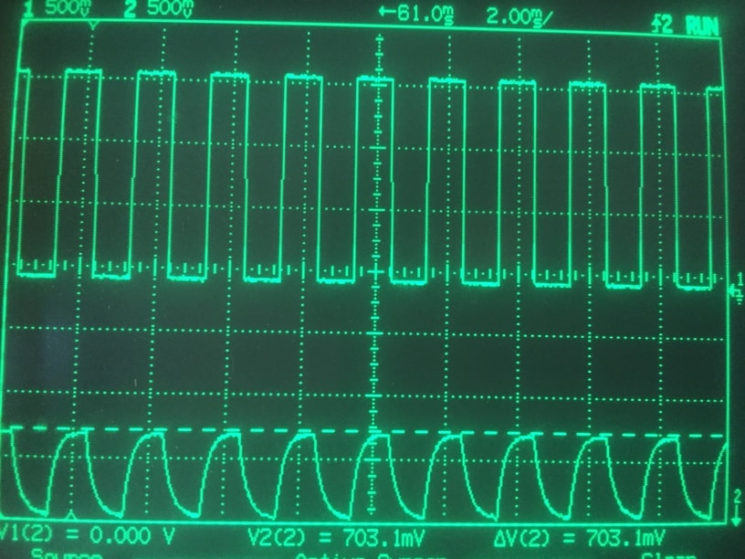

### LED selection
Not all LEDs behave as good as others so a preliminary evaluation of a set of different products is suggested:

1. Position a couple of identical LEDs on a breadboard aiming at each other
2. Connect one channel of the oscilloscope to the positive lead of one LED
3. Power the connected LED with a 500Hz square wave
4. Connect oscilloscope's remaining channel to the other LED's positive lead
5. Connect all grounds together

If you don't have a square wave generator you can use an Arduino:
```cpp
digitalWrite(12, HIGH);
delay(1);
digitalWrite(12, LOW);
delay(1);
```

Looking at the 2 channels it should be observed:

- The Transmitter's channel showing a crisp 5v signal
- The Receiver's channel showing a lower voltage signal with transitions slopes

Testing different LEDs with the same conditions shows that some produce a higher or lower voltage and transitions that are steeper or slower and more gradual. To obtain the best performance it is required to find a LED with the following characteristics:
- Highest voltage produced when hit by light
- Fastest and steepest transitions between states

The picture below shows the [KCL5587S](https://datasheet.octopart.com/KCL5587S-Kodenshi-datasheet-62058055.pdf) that is evidently not the LED we are looking for.



The [L-53SF4C](https://www.rapidonline.com/pdf/55-9204_v1.pdf) instead is able to run flawlessly at MODE 3 (3773Bb or 471B/s):


The picture below shows a bidirectional exchange where both packet and acknowledgement are clearly visible:


